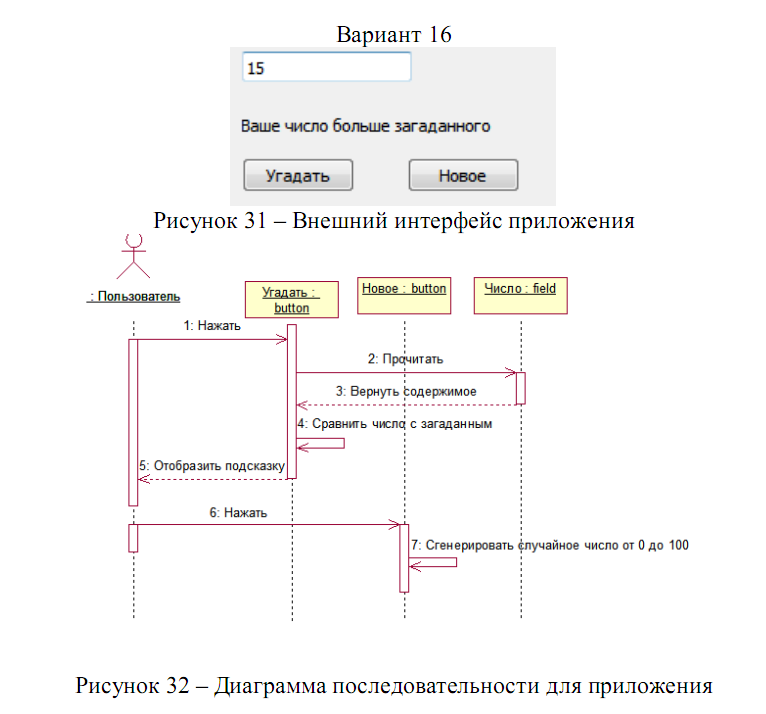

# Cross-Platform Programming
All labs of Cross-Platform Programming. Labs 1-4 are written on Java. Other - on Scala

## Tasks
Here you can find tasks, that I made on my lab work.
* [lab1](README.md#Lab1)
* [lab2](README.md#Lab2)
* [lab3](README.md#Lab3)
* [lab4](README.md#Lab4)

### Lab1  
Game: Divine the number from 1 to 100

### Lab2  
Make a simple zoo simulator
### Lab3  
Make a simpe university
### Lab4  
Add two vectors. Every pair of numbers must calculare in different thread.
